# Stock Market Anomaly Detection

This project aims to apply various anomaly detection techniques to detect outliers in stock market data. We specifically focus on Intel's (NASDAQ: INTC) stock performance from 1985 to 2014. 

## Anomaly Detection Techniques
* [Statistical Outlier Detection (z-score and mahalanobis distance)](#statistical-outlier-detection)
* [Isolation Forest](#isolation-forest)
* [One-Class SVM](#one-class-svm)
* [K-Means](#k-means)
* [Local Outlier Factor](#local-outlier-factor)
* [Angle-Based Outlier Detection](#angle-based-outlier-detection)
* [Autoencoder](#autoencoder)
* [LSTM](#lstm)

## Usage
* Python 3.9 -> see `requirements.txt` for dependencies
* See `data_preprocessing.ipynb` for EDA
* Run each Jupyter notebook individually

## Data
* The project uses historical stock market data obtained from Yahoo Finance using the yfinance python module

## Background
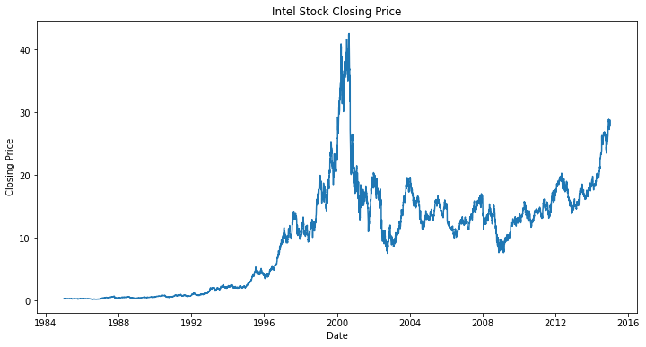
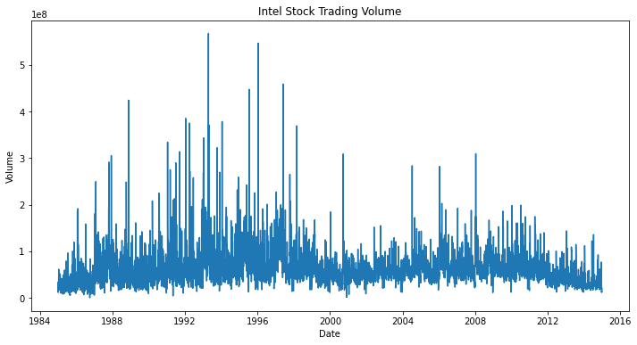

Intel has been pivotal in the semiconductor industry, with its stock experiencing significant fluctuations from 1985 to 2014 due to key events and technological milestones. In the late 1980s, Intel became a leader in microprocessor manufacturing with its 386 and 486 processor lines, fueling the PC revolution. The early 1990s saw Intel’s stock soar as it introduced the Pentium processor, setting new standards for performance and solidifying Intel’s dominance in computing. However, the early 2000s brought volatility amid the dot-com bubble burst, which impacted tech stocks broadly, including Intel. Later in the decade, Intel faced competition from AMD and shifts toward mobile computing, leading to mixed stock performance. The 2008 financial crisis further amplified this volatility, yet Intel adapted with strategic investments in data centers and processors optimized for energy efficiency. This period of market and technology-driven changes in Intel's stock makes it ideal for anomaly detection, as it captures both industry-wide disruptions and specific responses by Intel, offering a rich dataset to test how well various algorithms can identify notable events impacting stock valuation.

## Statistical Outlier Detection
This anomaly detection method involves computing basic statistics about the data and determining outliers based on z-score values.

How to calculate a z-score for a given technical indicator x:\
z-score = (mean - x)/standard_deviation

We consider an outlier to be any date at which one of the technical indicators was outside of a 4 standard deviation range from its mean. We also consider the Mahalanobis distance, which accounts for covariance between two indicators. Learn more [here](https://www.machinelearningplus.com/statistics/mahalanobis-distance/)

We find 48 outliers in volume, as shown below.
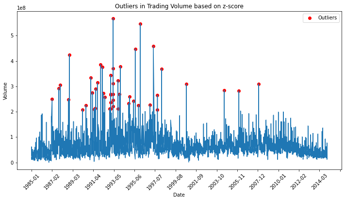

We find 40 outliers in MACD, as shown below.
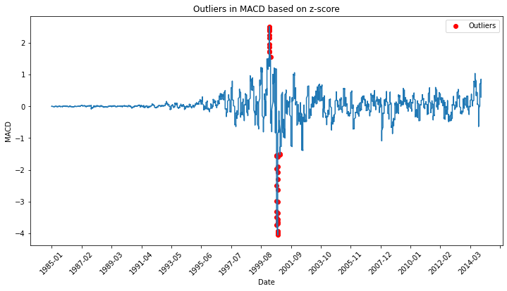

We find 43 outliers based on Mahalanobis distance, which considers the distance between each multivariate data point and the mean of the data.
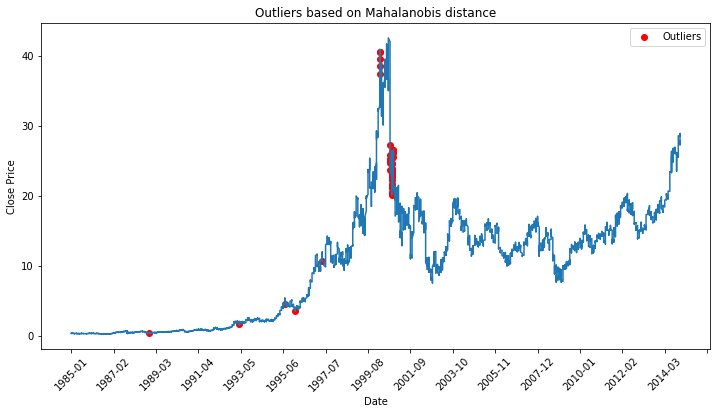

Many of the outliers seem to be associated with the Dot-Com Crash of 2000.

## Isolation Forest
This anomaly detection method involves training a random forest and then identifying data points that are isolated in fewer splits. This method can be applied to high-dimensional data and is relatively insensitive to the distribution of the data. Learn more [here](https://www.geeksforgeeks.org/what-is-isolation-forest/)

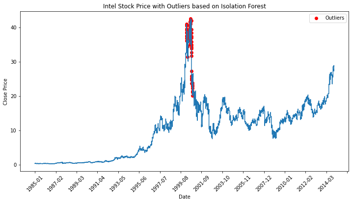

We find 76 outliers, all of which seem to identify the Dot-Com Crash.

## One-Class SVM
This anomaly detection method uses a support vector machine to learn a decision boundary in high dimensional space to isolate outliers. This method is also effective for high-dimensional data and is computationally efficient, but requires parameter tuning for nu -- the proportion of outliers. Learn more [here](https://www.geeksforgeeks.org/understanding-one-class-support-vector-machines/)

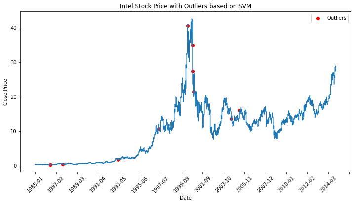

In this case the one-class SVM finds 11 outliers, some of which relate to the Dot-Com Crash but others which are between 1985 and 1997. Intuitively this method does not seem to isolate the data as well as the isolation forest.

## K-Means
This anomaly detection method divides the data into clusters. Data points that are exceptionally far (>6x mean distance from centroid) from their cluster's centroid are considered to be outliers. This method is simple and computationally efficient, but is quite sensitive to the choice of initial centroids and k (number of clusters). Learn more [here](https://www.geeksforgeeks.org/k-means-clustering-introduction/)

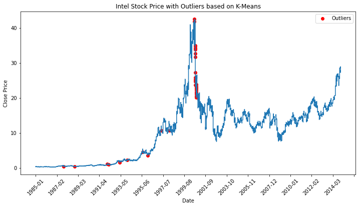

We find 39 outliers. The identified patterns are similar to the one-class SVM in that it finds days related to the Dot-Com Crash and also days in the years beforehand. Based on how it was tuned, however, this model is more sensitive to outliers. 

## Local Outlier Factor
This is a density-based anomaly detection method that identifies outliers based on local density. Local density represents how crowded the area around a point is. We consider outliers to be points which are significantly less dense than their neighbors. This method is effective for non-uniformly distributed data but is sensitive to the choice of parameters (n_neightbors) and may be computationally expensive. Learn more [here](https://www.geeksforgeeks.org/local-outlier-factor/)

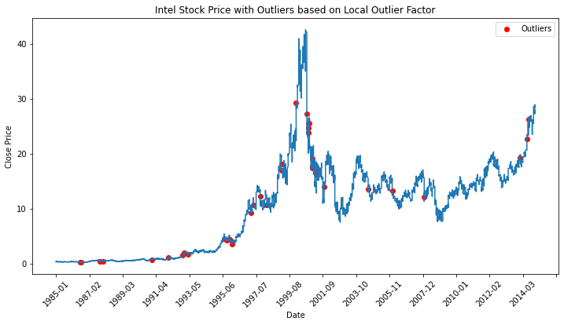

We find 38 outliers that are spread throughout the period in consideration. The clear trend is that these points are at times of sudden rise or fall in the stock price.

## Angle-Based Outlier Detection
This anomaly detection method clusters the data using KNN (K-Nearest Neighbors) and computes the angles formed by the vectors connecting data points to their neighbors. We consider an outlier to have at least one angle that is signficantly different than average. This method is particularly effective for high-dimensional data and considers direction rather than distance. However, it is sensitive to the choice of K (number of neighbors) and angle threshold. Learn more [here](https://blog.paperspace.com/outlier-detection-with-abod/)

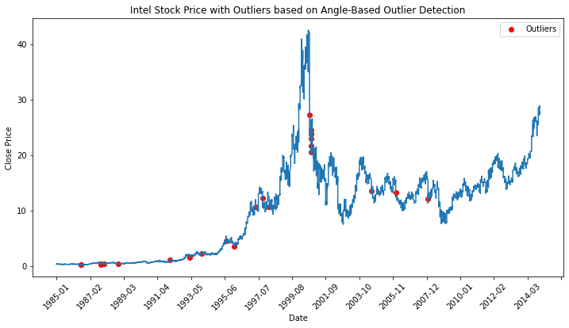

We find 25 outliers that seem to primarily represent periods of rapid dip in stock price. The outliers are spread throughout the period in consideration but there is a clear cluster during the Dot-Com Crash.

## Autoencoder
This is an anomaly detection method in which we train an Autoencoder to reconstruct our data. We consider outliers to be data points that have a high reconstruction error. This method leverages a neural network architecture to capture non-linear relationships in the data. However, it may be computationally expensive to choose appropriate parameters/hyperparameters and train the model. Learn more [here](https://www.geeksforgeeks.org/auto-encoders/)

We find 58 outliers that primarily identify days surrounding the Dot-Com Crash. This model seems to have yielded the most promising results because it considers the non-linear relationships within the data.

## LSTM
LSTM (Long Short-Term Memory) is a type of recurrent neural network (RNN) designed to handle long-term dependencies, as well as non-linear relationships, in time series data. This method can be computationally expensive and requires preprocessing the data to properly capture its sequentiality. Learn more [here](https://www.geeksforgeeks.org/deep-learning-introduction-to-long-short-term-memory/)

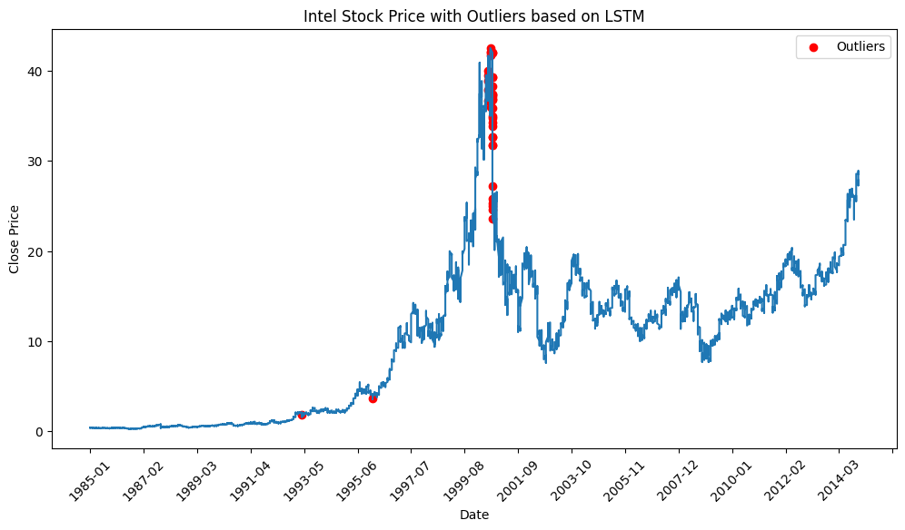

We find 38 outliers that primarily identify days surrounding the Dot-Com Crash. Similarly to the autoencoder, this is another model that yields promising results because it is able to capture non-linear relationships within the data.

## Additional Considerations
Some machine learning models that I would add to this repository are:
* [Transformers](https://www.ibm.com/topics/transformer-model)
* [Temporal Convolutional Networks](https://unit8.com/resources/temporal-convolutional-networks-and-forecasting/)
* [LSTM-Variational Autoencoders](https://ieeexplore.ieee.org/document/9053558)
* [Gated Recurrent Units](https://www.geeksforgeeks.org/gated-recurrent-unit-networks/)
* [Generative Adversarial Networks](https://www.geeksforgeeks.org/generative-adversarial-network-gan/)